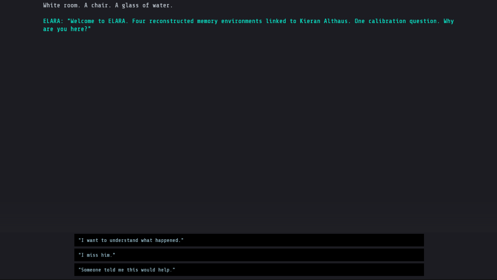
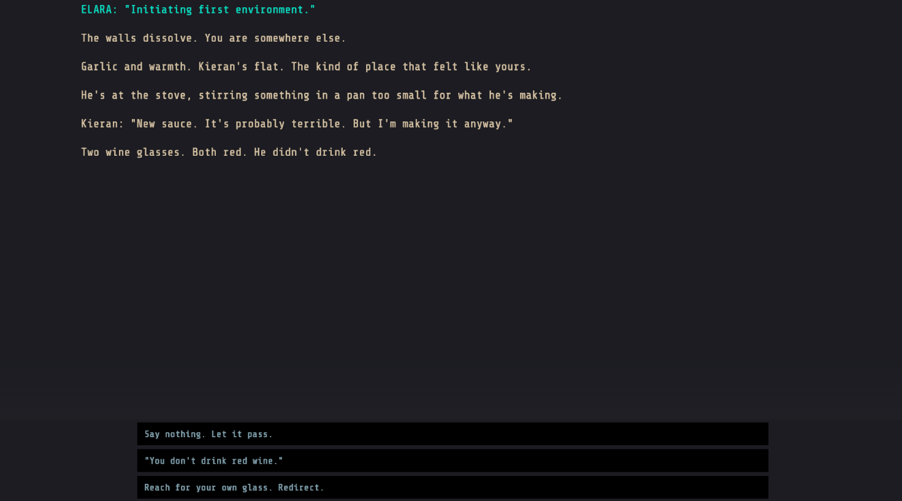
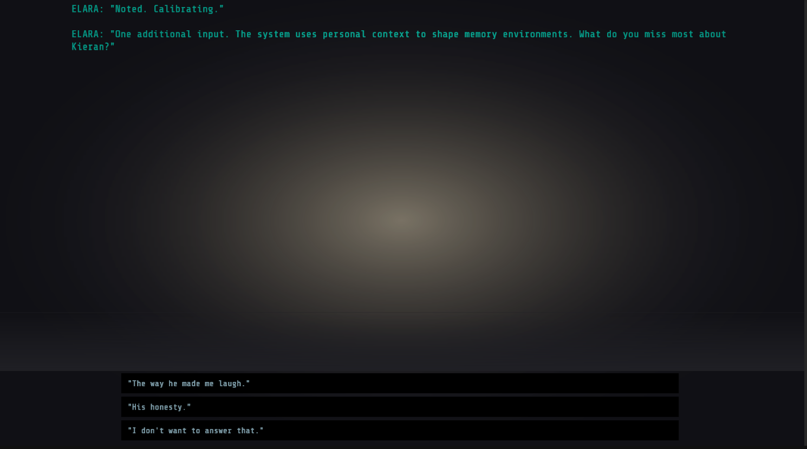
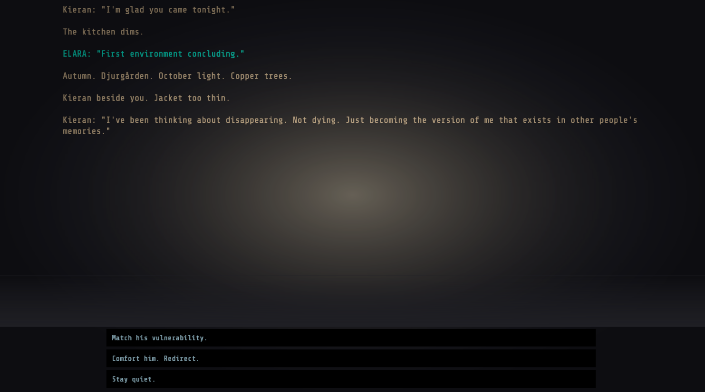

# Fabricade

Fabricade is a text-based interactive fiction game built as a research instrument for a Master's thesis investigating player experience of emotionally adaptive game narratives. The game is developed in Unity using the Ink narrative scripting language.

## About

The player takes on the role of someone who has recently lost a close friend, Kieran. They enrol in a clinical programme run by ELARA (Emotional Landscape and Retrieval Architecture), an AI system that reconstructs shared memories as a form of grief therapy. Across six scenes, the player makes narrative choices that shape how the system responds.


The start screen presents the player with two sessions. Each condition represents a fundamentally different approach to how the game responds to the player's choices. The player is not told what the difference is. They simply choose and play.

### Scenes

1. **Intake** - Initial session with ELARA
2. **The Dinner** - A reconstructed memory of a shared meal
3. **The Park Bench** - A reflective moment in an autumn park
4. **The Hospital Corridor** - A disorienting clinical environment
5. **The Room** - The revelation scene
6. **Discharge** - Final session and resolution

## How Adaptation Works

Every choice the player makes is tracked through internal behavioural variables: *openness*, *deflection*, *resistance*, *emotional posture*, and *trust in the system*. These variables accumulate across scenes, forming a behavioural profile that reflects how the player engages with grief, memory, and the system itself. The two conditions use this same profile but express adaptation through entirely different channels.

### Condition A: Narrative Dialogue Adaptation

In Condition A, the system listens to the player's choices and responds through language. ELARA's commentary shifts in tone and directness, Kieran's dialogue within the reconstructed memories adjusts to reflect the emotional stance the player has taken, and the player's own internal monologue reinterprets events differently depending on accumulated choices. A player who consistently confronts the system encounters substantively different narrative text than one who accepts or deflects.



Here, ELARA directly engages the player: *"Why are you here?"* The three choices each signal a different emotional posture. Choosing *"I want to understand what happened"* registers openness. Choosing *"I miss him"* registers vulnerability. Choosing *"Someone told me this would help"* registers deflection. ELARA's subsequent dialogue adapts based on what the player reveals, and that adaptation carries forward into every scene that follows.



By the dinner scene, ELARA initiates the first reconstructed memory. The player is placed in Kieran's flat. The narrative text itself is where adaptation lives: the details Kieran mentions, the way the player's internal voice frames the moment, and the weight each choice carries all shift based on the behavioural profile built from prior scenes. The choices here ("Say nothing. Let it pass." vs. "You don't drink red wine." vs. "Reach for your own glass. Redirect.") further refine the player's emotional trajectory, feeding back into the system for later scenes.

### Condition B: Atmospheric Aesthetic Adaptation

In Condition B, the narrative text stays the same regardless of choices. ELARA speaks minimally ("Noted. Calibrating.") and offers no interpretive commentary. Instead, the game adapts through what the player sees and feels: vignette overlays darken the screen edges to create a sense of enclosure or exposure, a warm glow emanates from the centre during intimate moments and recedes during clinical ones, text glitch effects scramble characters into symbolic noise at moments of narrative disruption, and a screen glitch effect fractures the display at the threshold between the hospital corridor and the revelation scene.



The same intake scene, but the experience is entirely different. ELARA says almost nothing. Instead, the warm glow overlay at the centre of the screen and the vignette darkening at the edges respond to what the player chooses. The atmosphere becomes the system's voice. The player is still making the same choices, still building the same behavioural profile, but the feedback loop operates through feeling rather than language. The question *"What do you miss most about Kieran?"* is framed identically, but the visual warmth or coldness surrounding the text shifts based on prior choices.



As the narrative progresses into later scenes, the atmospheric shifts become more pronounced. The warm glow intensifies or fades depending on the player's accumulated emotional posture. The vignette tightens during moments of tension. When narrative reality begins to fracture (Kieran says something he should not know, a corridor appears that does not belong), the text itself glitches before the player's eyes: characters scramble into noise, creating a visceral disruption that no amount of dialogue could replicate. The player's agency is still fully intact, but the system's response is felt rather than read.

## The Research Question

Both conditions raise the same question: *How do players experience emotionally adaptive game narratives when the mode of adaptation varies?* By holding the narrative constant and changing only the adaptive channel, Fabricade isolates whether players experience adaptation differently when it operates through semantic content versus sensory atmosphere, and what that difference reveals about player agency, immersion, and emotional engagement.

## Tech Stack

- **Unity** (URP)
- **Ink** (narrative scripting via inkle's Ink-Unity integration)
- **TextMeshPro** (text rendering)
- **Share Tech Mono** (typeface)

## Project Structure

```
Assets/
  Ink/              # Narrative scripts (main.ink, variables.ink, scene0-5)
  Scripts/          # C# game logic
    AtmosphericController.cs   # Mood profiles, vignette/glow, transitions
    GlitchController.cs        # Screen and text glitch effects
    NarrativeManager.cs        # Ink runtime bridge
    UIManager.cs               # Text display, typewriter, choices
    BehavioralLogger.cs        # Session logging (JSON)
    NarrativeScroller.cs       # Scroll handling
  Audio/            # Ambient audio tracks
  Fonts/            # Share Tech Mono typeface
  Scenes/           # Unity scene
```

## How to Run

### From Unity Editor
1. Open the project in Unity (URP)
2. Open `Assets/Scenes/SampleScene.unity`
3. Press Play
4. Select Condition A or Condition B from the start screen

### From Build
1. Download the build for your platform
2. Run the executable
3. Select your condition and play

## What This Demonstrates

- **Adaptive narrative systems** — two distinct models of real-time emotional adaptation driven by player behaviour
- **Player behavioural modelling** — tracking and responding to accumulated choice patterns across openness, deflection, resistance, and emotional posture
- **Experimental design for interactive media** — within-subjects study with counterbalanced conditions, structured questionnaires, and qualitative analysis
- **Unity + Ink integration** — bidirectional communication between Ink narrative state and Unity presentation layer (atmospheric overlays, glitch effects, audio)

## Session Logging

The game automatically logs each session to `SessionLogs/` in JSON format, recording every choice made, timestamps, hesitation times, and condition assignment.

## Author

Sakib Ahsan Dipto
Master's in Design for Creative and Immersive Technology
Stockholm University, Department of Computer and Systems Sciences
