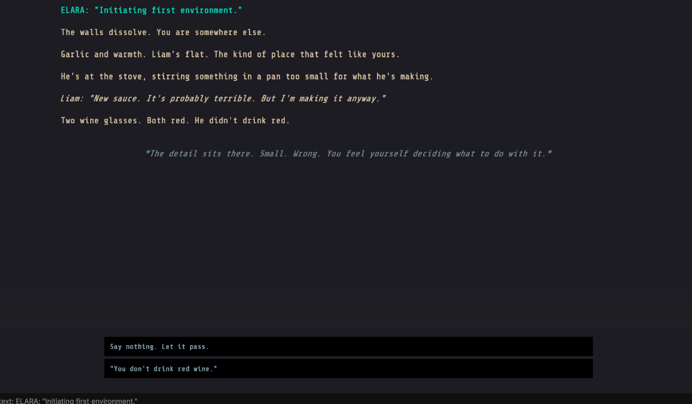
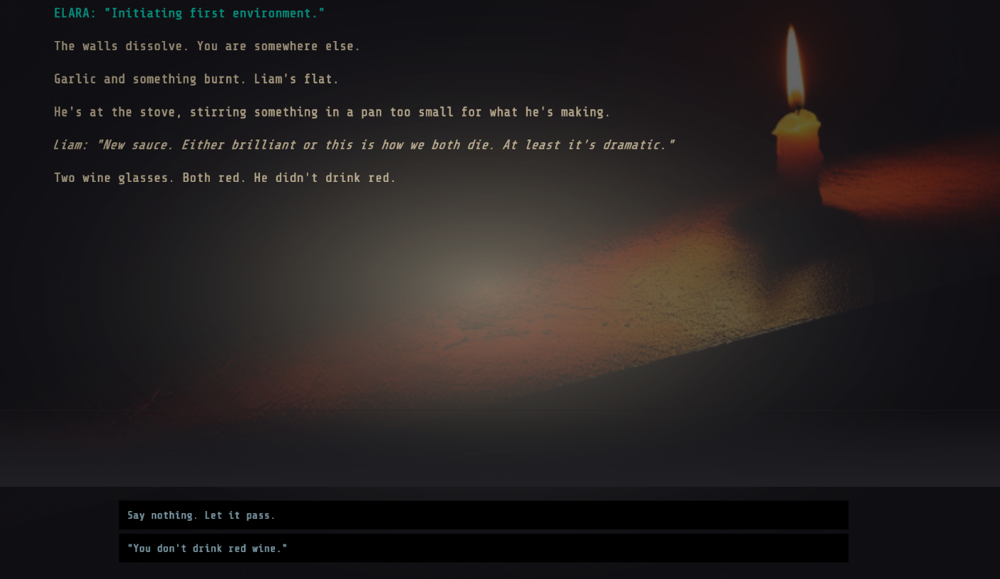
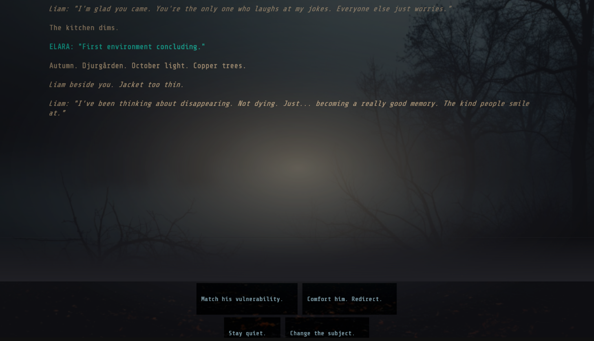

# Fabricade

Fabricade is a text-based interactive fiction game built as a research instrument for a Master's thesis investigating player experience of emotionally adaptive game narratives. The game is developed in Unity using the Ink narrative scripting language and deployed as a WebGL browser game.

**[Play Fabricade](https://sakib13.itch.io/fabricade)**

## About

The player takes on the role of someone who has recently lost a close friend, Liam. They enrol in a clinical programme run by ELARA (Emotional Landscape and Retrieval Architecture), an AI system that reconstructs shared memories as a form of grief therapy. Across six scenes, the player makes narrative choices that shape how the system responds.

The start screen presents two conditions. Each represents a fundamentally different approach to how the game responds to the player's choices. The player is not told what the difference is. They simply choose and play. After completing one condition, a Play Again button returns the player to the start screen for the second session.


### Scenes

1. **Intake** : Initial session with ELARA
2. **The Dinner** : A reconstructed memory of a shared meal
3. **The Park Bench** : A reflective moment in an autumn park
4. **The Hospital Corridor** : A disorienting clinical environment
5. **The Room** : The revelation scene
6. **Discharge** : Final session and resolution

## How Adaptation Works

Every choice the player makes is tracked through internal behavioural variables: *openness*, *deflection*, *resistance*, *emotional posture*, *trust in the system*, and *mystery awareness*. These variables accumulate across scenes, forming a behavioural profile that reflects how the player engages with grief, memory, and the system itself. The two conditions use this same profile but express adaptation through entirely different channels.

### Condition A: Narrative Dialogue Adaptation

In Condition A, the system listens to the player's choices and responds through language. ELARA's commentary shifts in tone and directness, Liam's dialogue within the reconstructed memories adjusts to reflect the emotional stance the player has taken, and the player's own internal monologue reinterprets events differently depending on accumulated choices. A player who consistently confronts the system encounters substantively different narrative text than one who accepts or deflects.



The Dinner scene in Condition A. ELARA initiates the first reconstructed memory. The player's internal monologue surfaces the inconsistency, *"The detail sits there. Small. Wrong."*, and the player decides whether to confront or accept it. The narrative text, Liam's dialogue, and ELARA's responses all adapt based on prior choices.

### Condition B: Atmospheric Aesthetic Adaptation

In Condition B, the narrative text stays the same regardless of choices. ELARA speaks minimally and offers no interpretive commentary. Instead, the game adapts through atmosphere: vignette overlays darken the screen edges to create a sense of enclosure or exposure, a warm glow emanates from the centre during intimate moments and recedes during clinical ones, text glitch effects scramble characters into symbolic noise at moments of narrative disruption, a screen glitch effect fractures the display at the threshold between the hospital corridor and the revelation scene, and scene-specific images provide visual context for each memory environment.



The same Dinner scene in Condition B. The narrative text is identical, but the experience is transformed: a candlelit image sets the atmosphere, vignette overlays darken the edges, and a warm glow responds to the player's emotional posture. The system communicates through feeling rather than language.



The Park Bench scene in Condition B. The atmospheric glow shifts as the scene moves outdoors. Scene-specific imagery and four choice options arranged in a grid give the player a different sense of presence than Condition A's text-only environment.

## The Research Question

Both conditions raise the same question: *How do players experience emotionally adaptive game narratives when the mode of adaptation varies?* By holding the narrative constant and changing only the adaptive channel, Fabricade isolates whether players experience adaptation differently when it operates through semantic content versus sensory atmosphere, and what that difference reveals about player agency, immersion, and emotional engagement.

## Tech Stack

| Technology | Role |
|---|---|
| **Unity** (URP) | WebGL build |
| **Ink** | Narrative scripting via inkle's Ink-Unity integration |
| **TextMeshPro** | Text rendering and typewriter effect |
| **Share Tech Mono** | Typeface |
| **Google Apps Script** | Remote session log collection via Google Sheets |
| **WebGL jslib plugin** | Browser-native fetch for cross-origin log uploads |

## Project Structure

```
Assets/
  Ink/              # Narrative scripts (main.ink, variables.ink, scene0-5)
  Scripts/          # C# game logic
    AtmosphericController.cs   # Mood profiles, vignette/glow, transitions
    GlitchController.cs        # Screen and text glitch effects
    NarrativeManager.cs        # Ink runtime bridge, story reset
    UIManager.cs               # Text display, typewriter, choices, Play Again flow
    BehavioralLogger.cs        # Session logging (JSON, local + remote)
    NarrativeScroller.cs       # Scroll handling
  Plugins/          # WebGL interop
    WebGLPost.jslib            # Browser fetch for Google Sheets upload
  Audio/            # Ambient audio tracks
  Fonts/            # Share Tech Mono typeface
  Scenes/           # Unity scene
```

## How to Play

### Browser (Recommended)
Visit the [itch.io page](https://sakib13.itch.io/fabricade) and play directly in your browser. No download or account required. Works on any OS and modern browser with SharedArrayBuffer support.

### From Unity Editor
1. Open the project in Unity (URP)
2. Open `Assets/Scenes/SampleScene.unity`
3. Press Play
4. Select Condition A or Condition B from the start screen

## Session Logging

The game logs each session automatically. In WebGL builds, session data (choices, timestamps, hesitation times, condition assignment) is uploaded to a Google Sheets endpoint via a browser-native fetch call. In standalone builds, logs are saved locally to `SessionLogs/` in JSON format. Each condition played generates a separate session log entry.

## Author

Sakib Ahsan Dipto
Master's in Design for Creative and Immersive Technology
Stockholm University, Department of Computer and Systems Sciences
